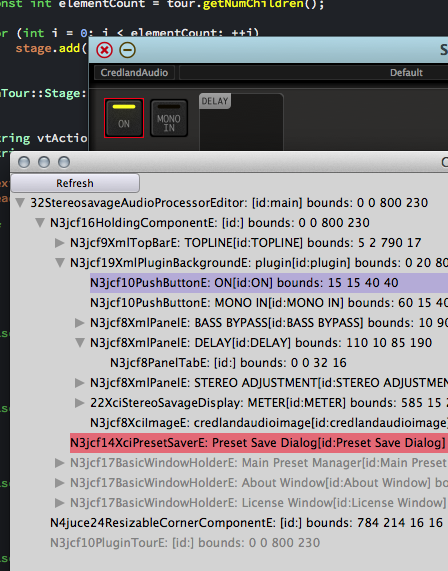
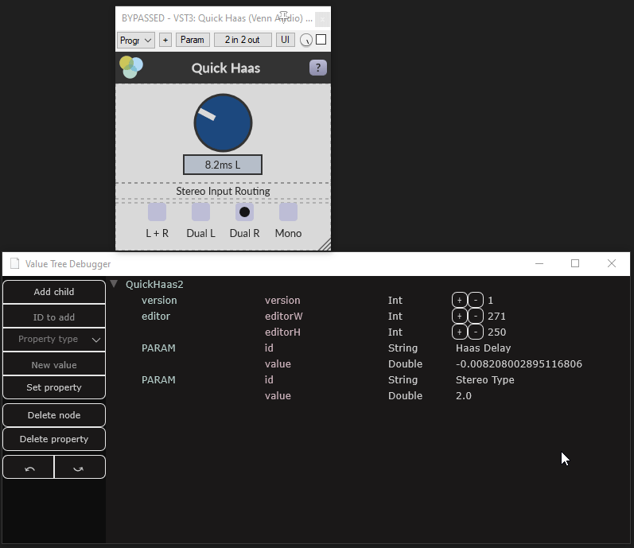
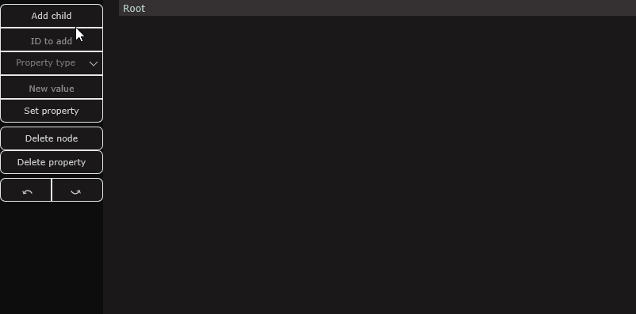
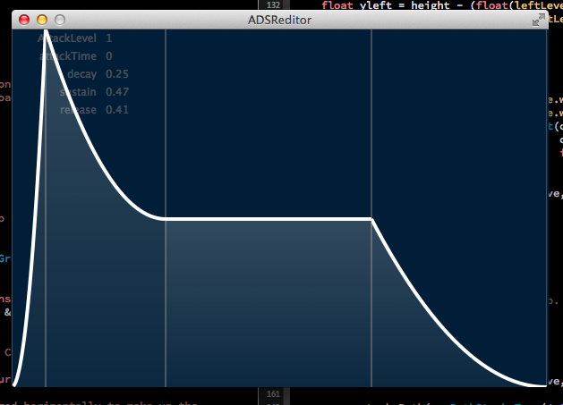

juce-toys
=========

## NATVIS

A NatVis file is provided to help with debugging in Visual Studio.  You won't
want to be without it.  Refer to Microsoft's NatVis instructions for
installation.  It'll need to go in the right folder. 

See https://msdn.microsoft.com/en-us/library/jj620914.aspx

## LLDB

An equivalent LLDB file is provided.  Installation instructions are in the
comments at the top of the file.  See juce_lldb_xcode.py.

If you'd like to add new types, see [Sudara's guide to creating lldb type summaries and children](https://melatonin.dev/blog/how-to-create-lldb-type-summaries-and-synthetic-children-for-your-custom-types/).

## JCF_DEBUG: JUCE Debugging Module

There are five development debugging utilities in the juce module jcf_debug.

I use these all the time. They are:

### ComponentDebugger

Attach one of these to a component and get a list of all its children as a tree in a separate window. Problem components are marked in:
  - grey (not visible)
  - yellow (off screen)
  - red (zero size)



The component debugger is pretty primative. You might want to instead look at this project which is a far sexier version of roughly the same idea:

https://github.com/sudara/melatonin_inspector
  
### ValueTreeDebugger

Attach this to a valuetree like so:
```
#include <jcf_debug/jcf_debug.h>

struct MyState
{
    juce::ValueTree state{};
    juce::UndoManager um{};
    jcf::ValueTreeDebugger vtDebugger{ state, &um };
}
```
And a separate window will open where you can:
 - Add child trees
 - Delete child trees
 - Add properties
 - Modify properties
 - Remove properties
 - Move nodes to become children of other nodes
 - Undo
 - Redo

#### Viewing updates



#### Modifying state



### BufferDebugger

One of these can be used to view a buffer (typically an array of floats) when debugging DSP code.  You can put a macros into your code at places you want to be able to inspect the buffer contents. I wrote it while debugging some auto-correlation code for a pitch shifter and it's been a life safer a couple of times since.

### FontAndColourDesigner

Allows you to easily flick between colours and fonts for a component. Handy when you are designing a UI.

The debuggers aren't pretty - but they are functional and shouldn't crash!  Let
me know if you get any problems!

## jcf_advanced_leak_detector Module

A utility you can add to a class when you have a memory leak from an object. It returns the stack back-trace of the leaked objects allowing you to find out where in your maze of source-code-complexity you created them!

## MULTITHREADING 

A JUCE Module for multi-threading problems in audio plugins.  See the Doxygen
documentation for more information. 
- garbage_collected_object - is a garbage collector I use for handling the
  deletion of objects on the message thread when the audio thread has finished
  with them. 
- nonblocking_call_queue.h - provides a lock-free mechanism for inter-thread
  function calls.  very useful in conjunction with the garbage collector.
- value_tree_clone.h - jules may have made this a relic of history with recent
  changes to JUCE, however this is the class I use for cloning a ValueTree from
  my message thread to my audio thread without locks (works in conjunction with
  the nonblocking call queue and the garbage collector). 

## Other

A collection of parts and ideas which might be useful to people using JUCE. 

### adsr_editor

A basic, but nice looking envelope editor.




## How to Get it

#### Cmake

  - FetchContent the repo
  - Link the module you're interested in:
    - `target_link_libraries(target PRIVATE jcf::debug)`
    - `target_link_libraries(target PRIVATE jcf::advanced_leak_detector)`
    - `target_link_libraries(target PRIVATE jcf::multithreading)`

 or

  - Clone the repo
  - `add_subdirectory()`
  - Link the module you're interested in:
    - `target_link_libraries(target PRIVATE jcf::debug)`
    - `target_link_libraries(target PRIVATE jcf::advanced_leak_detector)`
    - `target_link_libraries(target PRIVATE jcf::multithreading)`

#### Projucer
  - Clone the repo
  - Add the module you're interested in:
    - `juce-toys/jcf_debug`
    - `juce-toys/advanced_leak_detector`
    - `juce-toys/multithreading`

